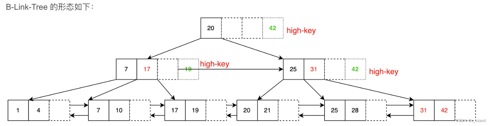
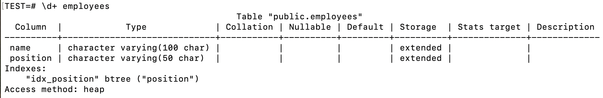
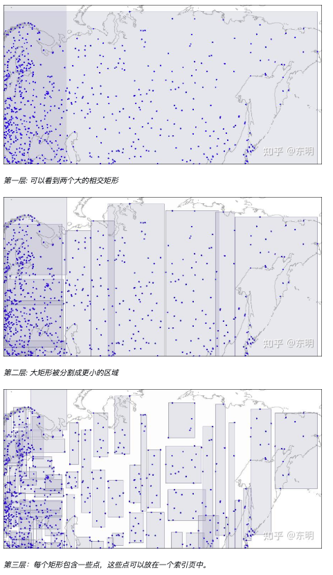
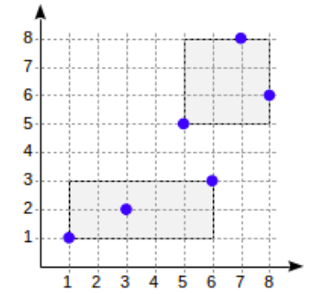
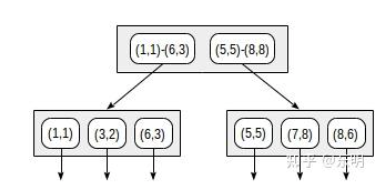

# 人大金仓数据库KingbaseES索引使用

# 1. 索引的定义：
索引（index）是帮助MySQL高效获取数据的数据结构

**优点**
* 提高数据检索的效率，降低数据库的IO成本（不需要全表扫描）
* 通过索引列对数据进行排序，降低数据排序的成本，降低了CPU的消耗    

**缺点**
* 实际上索引也是一张表，该表保存了主键与索引字段，并指向实体表的记录，所以索引列也是要占空间的
* 虽然索引大大的提高了查询速度，同时却会降低更新表的速度，因为更新表时，MySQL不仅要保存数据，还要保存一下索引文件
* 每次更新添加了索引列的字段，都会调整因为更新所带来的键值变化后的索引信息
* 索引只是提高效率的一个因素，如果MySQL有大量数据的表，就需要花时间研究建立最优秀的索引，或优化查询语句，索引都是不停的根据业务场景不停修改调整的

**索引设计原则**
创建索引会增加数据库系统开销，创建索引要注意以下几点：
1. 经常用于<u>查询</u>的字段创建索引。
2. 经常用于<u>查询</u>的字段创建索引。
3. 经常需要<u>根据范围来查询</u>的列上创建索引。
4. 经常<u>更新的表</u>要**避免**对其创建过多索引。
5. 不应在<u>数据量很少的表</u>上创建索引。
6. 不应在<u>数据取值区分度很小的**列**</u>上创建索引，如“性别”。


# 2. 索引概述
2.1 索引是什么？索引就是帮助存储系统快速获取信息的一种数据结构，形象的说就是数据的目录。
通过一个例子来理解：如果我们想查阅书中的某个知识点，我们是会一页一页翻找还是在书中目录去找呢？我们会先在书的目录中找，然后在看对应页的内容，这样能够节省时间加快效率。

## 2.2 KingbaseES支撑的索引类型

### **B-tree（自平衡多叉树结构）索引**
* B-tree索引能够在按顺序存储的数据之上的<u>等值和范围查询</u>。
* 在一个建立了索引字段中涉及到使用<u><、<=、=、>=、>等操作符</u>之一进行比较的时候。当查询条件中使用<u>between和in</u>以及索引列中涉及<u>is null或is not null条件</u>时。

**基础Btree存在的问题：**
* **查找性能不稳定：** Btree的查找性能依赖于目标值在树中的位置。如果值位于根节点，查找将非常迅速；但如果值位于较深的叶子节点，查找性能会下降。
* **不适合范围查找**：在一个建立了索引字段中涉及到使用<、<=、=、>=、>等操作符之一进行比较的时候，Btree节点数据的遍历需要中序遍历，可能导致较多节点的重复访问和回溯。
* 当查询条件中使用between和in，以及索引列中涉及is null或is not null条件时。
* 如查询的范围非常广泛，或者查询的结果集占据了表中很大一部分，那么数据库可能会选择不使用索引，使用全表扫描来获取数据。<br>

**B+Tree基于Btree的变形：** 仍然存在无法进行高效并发操作的问题
* 所有的key+value数据都保存在leaf叶子节点，root以及internal中间节点仅保存key用作索引。
* 所有的leaf节点之间都维护一个单向/双向指针，方便顺序遍历。

**B-Link-Tree基于Btree的变形：** 提升了B+Tree的并发访问性能
* 为每一个内部节点 新增了一个指向兄弟节点的右向指针。
* 为每一个内部节点引入一个额外的key (high-key)，它是当前节点以及所有子节点中最大的key。



默认创建B-tree索引的语法：
```sql
create index index_name on table_name(column_name);
```

example:
```sql
-- 创建一个名为‘emplyees’的表格
CREATE TABLE employees (
    name VARCHAR(100),
    position VARCHAR(50)
);

-- 插入一些数据
INSERT INTO employees (name, position) VALUES
('Alice', 'Engineer'),
('Bob', 'Manager'),
('Charlie', 'Engineer'),
('David', 'Analyst'),
('Eve', 'Manager');

-- 创建索引：假设经常需要根据员工的职位来查询数据
-- idx_position：是我们给索引起的名字
-- position：是我们要为其创建索引的列名
CREATE INDEX idx_position ON employees(position);
```

查看表上创建的索引：
```sql
-- 格式：\d+ table_name
\d+ employees
```


使用索引进行查询：
```sql
SELECT * FROM employees WHERE position = 'Manager';
```

删除索引：
```sql
DROP INDEX idx_position;
```

<br>
明确表示使用B-tree创建索引：<br>
Note：实际上在PostgreSQL中，如果不指定索引类型，默认就是创建B-tree索引。

```sql
CREATE INDEX idx_position ON employees USING btree(position);
```
<br>

### **Hash索引**：基于Hash表实现，只能用于等值查询。
* Hash索引就是采用一定的哈希算法，把键值换算成新的哈希值。检索时不需要类似B+树那样从根节点到叶子节点逐级查找，只需<u>一次哈希算法</u>即可立刻定位到相应的位置，速度非常快。
* Hash索引只能处理简单的**<u>等于比较</u>**，当查询条件中的列涉及到使用=操作符进行比较时，查询优化器会考虑使用Hash索引来加速查询。
* 注意⚠️：由于Hash索引操作不记录WAL（Write-Ahead Logging）日志，因此如果数据库发生崩溃，可能需要重新构建Hash索引。这会增加系统恢复的时间和开销。对hash索引的改变在初始的基础备份后不是基于流复制或者基于文件复制的，因此随后使用hash的查询会给出错误的回复，因而减少hash索引的使用是不错的选择。

创建Hash索引的语法：
```sql
CREATE INDEX idx_position ON employees USING hash(position);
```
<br>

###  GiST(Generalized Search Tree, 通用搜索树)索引
* 一种平衡的树形结构访问方法，其适用于多维数据和集合数据类型。同时，也可以把 GiST 看做一个新的构建访问方法的框架。
* btree索引常常用来进行例如<u>大于、小于、等于</u>这些操作，而在实际生活中很多数据其实不适用这种场景，例如<u>地理数据、文本文档、图像</u>等等。如果我们想要查询在某个地方是否存在某一点，即判断地理位置的"包含"那么我们就可以使用gist索引了。
* GiST索引允许定义规则来将任意类型的数据分布到一颗平衡树上，同时也允许定义一些方法访问这些数据。例如，GiST 索引可以支持R-树的accommodate运算，该运算支持计算空间数据的相对位置（位于左侧、右侧、包含等），也可以支持RD-树的交集和包含运算。
* 注意⚠️：MySQL不支持GiST索引

创建GiST索引的语法：
```sql
-- location列的数据类型是POINT类型, 在PostgreSQL中是与Gist索引兼容的。
CREATE INDEX idx_location ON SH_Map USING gist(location);
-- point_ops: 在创建索引时可以指定操作符类的名称
CREATE INDEX idx_location ON SH_Map USING gist(location point_ops);
```

* 注意⚠️：当尝试在PostgreSQL中使用Gist索引时，必须确保您正在索引的列的数据类型与Gist索引兼容，并且有一个为该数据类型定义的内建或自定义的Gist操作符类。如果不是<u>内建GiST操作符类</u>的索引数据类型，将会报错：
```sql
CREATE INDEX idx_stree_name ON SH_Map USING gist(stree_name);
```


**结构：**
* **内部节点**中的每行数据也包含一个谓词和一个指向孩子节点的指针，该节点的所有子树中被索引的数据必须满足其谓词。叶节点中的每行数据包含一个谓词（布尔表达式）和一个指向数据表中的行的TID，被索引的数据（key）必须满足其中的谓词。
* 一致性函数(consistent)的作用：GiST索引使用一致性函数（consistent）来确定节点中的数据是否满足搜索条件。对于非叶子节点，一致性函数决定是否需要继续查找对应的子节点。对于叶子节点，一致性函数决定被索引的数据是否满足搜索谓词。一致性函数该函数由GiST的接口定义，每个支持的运算符族可以自行实现该函数。
* GiST树的搜索是从根节点开始的。借助一致性函数可以找到哪些子节点应该继续查找，哪些子节点应该放弃，对于满足一致性函数的子节点继续重复该算法。如果找到叶子节点，则满足一致性函数的行就作为结果返回。搜索是**深度优先**的：算法首先尝试到达叶节点，这可以尽可能快的返回第一个结果。

#### R-树之点
- R-树的思想是将平面分割成矩形，这些矩形覆盖了所有被索引的点。每个索引行存储一个矩形，其谓词可以这样定义：**查找的点位于给定矩形内** 。
- R-树的根节点包含几个最大的矩形（可能相交）。子节点包含较小的矩形，这些矩形嵌套在父节点的矩形中，合起来覆盖所有点。
- 理论上，叶子节点必须包含被索引的点，但叶子节点和非叶子节点的数据类型必须相同，因此，叶节点同样需要存储矩形，但这些矩形 collapsed(折叠) 为点。

Example 1: 可视化的方式展示一个三层R-树结构，点是机场的坐标。


Example 2:一层R-树

```sql
-- crate a table named "points_table" 
-- column name "p" with type point
CREATE TABLE points_table(p point);

INSERT INTO points_table(p) VALUES
  (point '(1,1)'), (point '(3,2)'), (point '(6,3)'),
  (point '(5,5)'), (point '(7,8)'), (point '(8,6)');

CREATE INDEX on points_table using gist(p);
```
按照上图分裂后，索引结构如下：


创建的索引可以加速以下查询，如：查找给定矩形中包含的所有点 ，该条件可以形式化为<u>p <@ box '(2,1), (6,3)'</u> (运算符 <@ 来自points_ops运算符族，表示包含)。
```sql
-- crate a table named "points_table" 
-- column name "p" with type point
CREATE TABLE points_table(p point);

INSERT INTO points_table(p) VALUES
  (point '(1,1)'), (point '(3,2)'), (point '(6,3)'),
  (point '(5,5)'), (point '(7,8)'), (point '(8,6)');

CREATE INDEX on points_table using gist(p);
```
https://zhuanlan.zhihu.com/p/488550385


<br>

### **SP-GiST索引**：作为一种基础模板来实现多种搜索方法。
* SP-Gist索引类似于Gist索引，提供一个支持不同类型检索的架构，允许广泛不同的非平衡基于磁盘的数据结构的实施，例如四叉树，k-d树和根树。这些结构的共同特征是它们反复地将搜索空间划分成大小不需要相等的分区，匹配这些划分规则的搜索会很快。内建的SP-GiST操作符类有。
* 注意⚠️：MySQL不支持SP-GiST索引, 这是GiST索引的扩展。

###  **GIN索引**：一般用其搜索全文或JSON键值。
###  **BRIN索引**：用于存储连续相邻的数据块统计信息，可减少索引占用空间。


