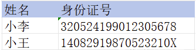
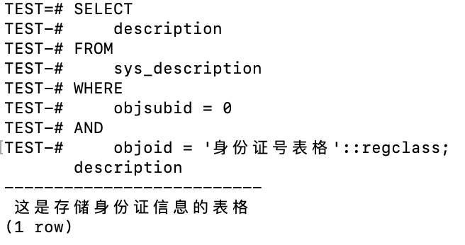
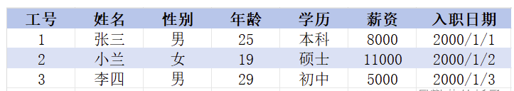
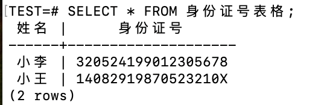
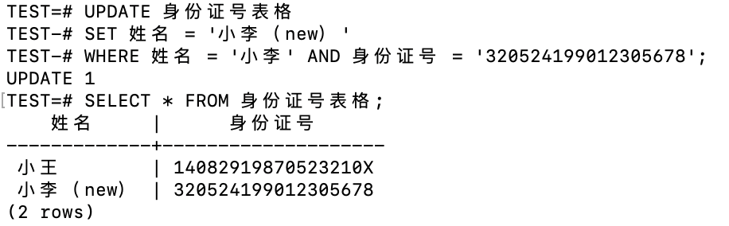

# 关于人大金仓KingBase数据库的常用命令和使用，以及基本语法：

# 2. 学习常用命令和使用。了解基本语法
## 2.1 建数据库, 建表格语句
1. 建数据库语句
直接使用Navicat Premium界面功能新建数据库。

2. 建表语句
```sql
CREATE TABLE 表名(
    列名1 数据类型1 [列级约束1],
    列名2 数据类型2 [列级约束2],
    ......
    [表级约束(主键、外键、唯一等)]
);
```
* 数据类型：该列可以存储的数据的类型（例如：字符、数字等）。
* 列级约束：该列的规则（例如：唯一、非空等）。
* 表级约束：应用于整个表或多个列之间的规则（例如：外键、检查等）。

Example 1：


* 第1列姓名：数据类型为字符，名字长度一般不超过64位。
* 第2列身份证号可能存在字母，所以属于字符类，长度为18位且唯一。
```sql
CREATE TABLE 身份证号表格(
    /*  列名       数据类型    列级约束    */
    姓名       text       NOT NULL,  -- 类型为字符，不能为空
    身份证号   CHAR(18)   UNIQUE     -- 长度为18位，且唯一
);
```

**对表格进行添加和查看描述**：

对表格进行添加描述：
```sql
--如果该表不存在描述则添加，如果存在则修改
COMMENT ON TABLE 身份证号表格 IS '这是存储身份证信息的表格';
```
对表格进行查看描述：
```sql
SELECT
    description
FROM
    sys_description
WHERE
    objsubid = 0
AND
    objoid = '身份证号表格'::regclass;
```


对表格进行删除描述：
```sql
--删除表的描述
COMMENT ON TABLE 身份证号表格 IS NULL;
```

Example 2：



```sql
CREATE TABLE 员工信息表(
/*  列名      数据类型        列级约束         */
    工号      int            primary key,    --整数类型，主键唯一约束
    姓名      varchar(128)   not null,       --字符类型，不能为空
    性别      varchar(2)     default '男',   --字符类型，默认'男'
    年龄      int            not null,       --整数类型，不能为空
    学历      varchar(32)    not null,       --字符类型，不能为空
    薪资      decimal(10,2)  not null,       --定点数类型，不能为空
    入职日期  date           default now()   --日期类型，默认当前日期
);
```
## 2.2 增删改查语句
**Example 1 - 插入数据：**


而小李、小王是属于表中的数据，则需要使用**INSERT**将其插入进去：
```sql
INSERT INTO 身份证号表格
VALUES
    ('小李', '320524199012305678'),
    ('小王', '14082919870523210X');
```
**Example 1 - 查询数据：**
```sql
SELECT * FROM 身份证号表格;
```


**Example 1 - 修改数据：**
```sql
UPDATE 身份证号表格
SET 姓名 = '小李（new）'
WHERE 姓名 = '小李' AND 身份证号 = '320524199012305678';
```


**Example 1 - 删除数据：**
```sql
DELETE FROM 表格名称
WHERE id = 某个值; --id一般是列名
```

```sql
DELETE FROM 身份证号表格
WHERE 姓名 = '小李（new）';
```


## 2.3 建立索引
### 2.3.1 索引的定义和概述：
索引是什么？索引就是帮助存储系统快速获取信息的一种数据结构，形象的说就是数据的目录。
通过一个例子来理解：如果我们想查阅书中的某个知识点，我们是会一页一页翻找还是在书中目录去找呢？我们会先在书的目录中找，然后在看对应页的内容，这样能够节省时间加快效率。

**优点**
* 提高数据检索的效率，降低数据库的IO成本（不需要全表扫描）
* 通过索引列对数据进行排序，降低数据排序的成本，降低了CPU的消耗    

**缺点**
* 实际上索引也是一张表，该表保存了主键与索引字段，并指向实体表的记录，所以索引列也是要占空间的
* 虽然索引大大的提高了查询速度，同时却会降低更新表的速度，因为更新表时，MySQL不仅要保存数据，还要保存一下索引文件
* 每次更新添加了索引列的字段，都会调整因为更新所带来的键值变化后的索引信息
* 索引只是提高效率的一个因素，如果MySQL有大量数据的表，就需要花时间研究建立最优秀的索引，或优化查询语句，索引都是不停的根据业务场景不停修改调整的

**索引设计原则**
创建索引会增加数据库系统开销，创建索引要注意以下几点：
1. 经常用于<u>查询</u>的字段创建索引。
2. 经常用于<u>查询</u>的字段创建索引。
3. 经常需要<u>根据范围来查询</u>的列上创建索引。
4. 经常<u>更新的表</u>要**避免**对其创建过多索引。
5. 不应在<u>数据量很少的表</u>上创建索引。
6. 不应在<u>数据取值区分度很小的**列**</u>上创建索引，如“性别”。


### 2.3.2 B-tree（自平衡多叉树结构）索引
* B-tree索引能够在按顺序存储的数据之上的<u>等值和范围查询</u>。
* 在一个建立了索引字段中涉及到使用<u><、<=、=、>=、>等操作符</u>之一进行比较的时候。当查询条件中使用<u>between和in</u>以及索引列中涉及<u>is null或is not null条件</u>时。

**基础Btree存在的问题：**
* **查找性能不稳定：** Btree的查找性能依赖于目标值在树中的位置。如果值位于根节点，查找将非常迅速；但如果值位于较深的叶子节点，查找性能会下降。
* **不适合范围查找**：在一个建立了索引字段中涉及到使用<、<=、=、>=、>等操作符之一进行比较的时候，Btree节点数据的遍历需要中序遍历，可能导致较多节点的重复访问和回溯。
* 当查询条件中使用between和in，以及索引列中涉及is null或is not null条件时。
* 如查询的范围非常广泛，或者查询的结果集占据了表中很大一部分，那么数据库可能会选择不使用索引，使用全表扫描来获取数据。<br>

**B+Tree基于Btree的变形：** 仍然存在无法进行高效并发操作的问题
* 所有的key+value数据都保存在leaf叶子节点，root以及internal中间节点仅保存key用作索引。
* 所有的leaf节点之间都维护一个单向/双向指针，方便顺序遍历。

**B-Link-Tree基于Btree的变形：** 提升了B+Tree的并发访问性能
* 为每一个内部节点 新增了一个指向兄弟节点的右向指针。
* 为每一个内部节点引入一个额外的key (high-key)，它是当前节点以及所有子节点中最大的key。


默认创建B-tree索引的语法：
```sql
create index index_name on table_name(column_name);
```

example:
```sql
-- 创建一个名为‘emplyees’的表格
CREATE TABLE employees (
    name VARCHAR(100),
    position VARCHAR(50)
);

-- 插入一些数据
INSERT INTO employees (name, position) VALUES
('Alice', 'Engineer'),
('Bob', 'Manager'),
('Charlie', 'Engineer'),
('David', 'Analyst'),
('Eve', 'Manager');

-- 创建索引：假设经常需要根据员工的职位来查询数据
-- idx_position：是我们给索引起的名字
-- position：是我们要为其创建索引的列名
CREATE INDEX idx_position ON employees(position);
```

查看表上创建的索引：
```sql
-- 格式：\d+ table_name
\d+ employees
```


使用索引进行查询：
```sql
SELECT * FROM employees WHERE position = 'Manager';
```

删除索引：
```sql
DROP INDEX idx_position;
```

<br>
明确表示使用B-tree创建索引：<br>
Note：实际上在PostgreSQL中，如果不指定索引类型，默认就是创建B-tree索引。

```sql
CREATE INDEX idx_position ON employees USING btree(position);
```
<br>


## 2.4 多表查询 


## 2.5 语句类型


## 3. 连接驱动, 代码适配等项目适配。
在进行连接驱动、代码适配等项目适配工作时，通常涉及多个方面的调整和优化，以确保不同系统、组件或代码库之间能够无缝对接和高效运行。以下是一些具体的工作内容：

1. 需求分析与规划
理解业务需求：首先，需要明确项目适配的目的、范围和目标，了解业务场景、用户需求以及期望达成的效果。
评估现有系统：对现有系统的架构、技术栈、性能状况等进行全面评估，识别潜在的兼容性问题或技术瓶颈。

2. 连接驱动适配
驱动选型与安装：根据项目需求选择合适的数据库、设备或服务驱动，并确保其正确安装和配置。
接口对接：编写或修改代码以适配驱动提供的API或SDK，实现与驱动的无缝连接。
参数调优：调整驱动配置参数，优化连接性能，如调整连接池大小、超时设置等。

3. 代码适配
语言与框架统一：如果项目涉及多种编程语言或框架，需要进行代码风格和结构的统一，确保代码的可读性和可维护性。
库与依赖管理：更新或替换不兼容的库和依赖项，确保所有组件使用兼容的版本。
功能迁移与重构：将原有系统的功能迁移到新环境或框架中，必要时进行代码重构，以提高代码质量和性能。

-- PostgreSQL 不支持 DROP TABLE IF EXISTS 语句直接带反引号，也不使用反引号来标识标识符