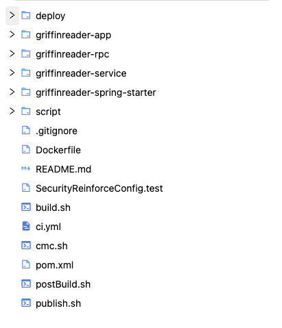
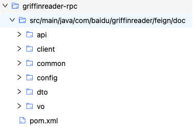
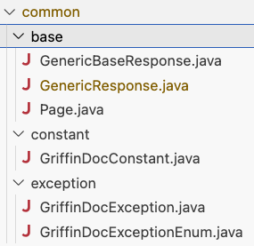
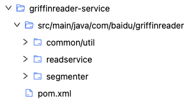
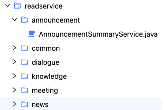

# 目录结构


* **顶级目录:<br>**
deploy：这个目录可能包含了**部署相关的脚本或配置文件**，用于将项目部署到<u>生产环境或其他目标环境</u>中。

* **应用程序模块：<br>**
    * griffinreader-app：**项目的主应用程序模块**，<span style="color: red;">包含了用户界面、业务逻辑等核心功能</span>。
    * griffinreader-rpc：这个模块实现了**远程过程调用（RPC）**功能，用于应用<u>程序不同部分之间的通信</u>。
    * griffinreader-service：这个模块提供了**后端服务**，<span style="color: red;">如数据访问、业务逻辑处理等</span>。
    * griffinreader-spring-starter：<span style="color: red;">这个模块可能是一个Spring Boot启动器，用于简化项目配置和启动过程</span>。

* 脚本和配置文件：
script：这个目录可能包含了各种脚本文件，用于自动化构建、测试、部署等任务。
.gitignore：这个文件指定了Git版本控制系统应该忽略的文件和目录。
Dockerfile：这个文件包含了构建Docker镜像的指令。
README.md：这个文件通常包含了项目的简介、安装指南、使用说明等信息。
SecurityReinforceConfig.test：这个文件可能是一个测试类，用于验证安全增强配置的有效性。
build.sh、cmc.sh、postBuild.sh、publish.sh：这些脚本文件可能分别用于构建、配置管理、构建后处理和发布任务。
ci.yml：这个文件可能是持续集成（CI）的配置文件，用于定义自动化构建和测试的流程。
pom.xml：这个文件是Maven项目的核心配置文件，用于定义项目的依赖、插件、构建目标等。

项目构建和部署流程推测
基于上述文件结构，我们可以推测这个项目的构建和部署流程可能如下：

使用build.sh脚本进行项目的构建，可能包括编译代码、打包应用程序等步骤。
使用postBuild.sh脚本进行构建后的处理，如生成文档、执行测试等。
使用publish.sh脚本将构建好的应用程序发布到指定的环境中。
在持续集成过程中，ci.yml配置文件定义了自动化构建和测试的流程，可能包括代码检查、单元测试、集成测试等步骤。
使用Docker进行容器化部署时，Dockerfile文件指定了构建Docker镜像的指令。
总结
这个项目是一个包含多个模块和配置文件的软件项目或应用程序。它可能使用了Maven作为构建工具，Docker作为容器化技术，以及Git和持续集成工具进行版本控制和自动化构建。项目的构建和部署流程可能包括构建、测试、发布等多个步骤，这些步骤通过脚本和配置文件进行自动化处理。

# 1 deploy 文件夹
## 1.1 demo.Dockerfile
**概述**：如何使用Dockerfile构建名为griffinreader-app的Docker镜像。该镜像基于Baidu容器仓库的openjdk:17-jdk镜像，并包含了特定的应用程序代码和配置。
- 使用Baidu容器仓库中的openjdk:17-jdk作为基础镜像。
- 设置环境变量APP_DIR，用于指定应用程序的工作目录。将工作目录设置为APP_DIR。
- 在工作目录下创建一个名为source的子目录，用于存放应用程序的源代码。
- 添加后端griffinreader-app应用程序代码到source目录中。然后解压加到source中的griffinreader-app应用程序代码。
- 最后的CMD用来指定容器启动时默认执行的命令。

## 1.2 deploy_app_demo.sh
**概述**: 是一个Shell脚本，通常用于<u>自动化构建和打包</u>过程。从内容来看，它主要涉及项目的**清理、编译、打包以及安全加固配置文件的复制**等任务。
- 确保每次构建都是在一个干净的环境中进行，避免旧文件干扰新构建的结果。
```shell
rm -rf output #首先删除旧的output目录（如果存在）。-rf：recursive and force
mkdir -p output #重新创建该目录；-p：用于创建指定路径中的所有目录（包括任何必要的父目录）。
```
- **设置PATH和JAVA_HOME环境变量**：确保后续使用的Java命令和工具指向特定的Oracle JDK 17.0.1版本。
- **Maven构建和部署**：强制更新依赖项，clean清理之前的构建输出，跳过测试阶段，deploy并将最终的构建工件部署到远程仓库中。
- **打包应用**：创建文件mkdir，然后再打包文件tar。
- **复制安全加固配置文件**：将安全加固配置文件SecurityReinforceConfig.test复制到output目录下，为了在部署或运行时应用安全加固策略。
```shell
mkdir -p output/griffinreader-app
tar -zcvf output/griffinreader-app/griffinreader-app.tar.gz -C ./griffinreader-app/output/griffinreader-app-release-package .

# 拷贝加固配置文件到指定文件夹下
cp ./SecurityReinforceConfig.test output/
```

## 1.3 deploy_starter.sh
代码和1.2 deploy_app_demo.sh一样，除去打包应用和复制安全加固配置文件的代码不一样。
将griffinreader-spring-starter模块构建输出的JAR文件复制到这个子目录中，并重命名为griffinreader-spring-starter（去掉了原路径中的其他部分）。
```shell
mkdir -p output/starter
cp griffinreader-spring-starter/output/griffinreader-spring-starter.jar output/griffinreader-spring-starter
```


# 2. griffinreader-app folder
## 2.1 src/main
### 2.1.1 java/com/baidu/griffinreader/GriffinReaderApp.java
**概览**：是项目的核心启动文件，负责初始化 Spring Boot 应用及其相关配置，确保应用能够正确运行并与其他服务进行交互。
- **@SpringBootApplication**: 包含了 @Configuration，@EnableAutoConfiguration 和 @ComponentScan。标志着这是一个 Spring Boot 应用的主配置类，自动配置并启动 Spring 上下文。
- **@EnableConfigurationProperties**:启用对 @ConfigurationProperties 注解的配置属性支持，允许将配置文件中的属性绑定到 Java Bean 上。
- **@EnableFeignClients**: 启用 Feign 客户端，Feign 是一个声明式的 HTTP 客户端，用于简化远程服务调用。表明该应用可能会调用其他微服务。
- **@ComponentScan(basePackages = {"com.baidu"})**:指定 Spring 组件扫描的基础包，这里设置为 com.baidu，意味着 Spring 会扫描这个包及其子包下的所有组件（如 @Component, @Service, @Repository 等）。
- **@MapperScan({"com.baidu.griffinreader..dao"})**:指定 MyBatis Mapper 接口的扫描路径，这里设置为 com.baidu.griffinreader 包下任意子包中的 dao 目录。

### 2.1.2 resources
resources文件夹是一个在软件开发中常见的目录，用于存放应用程序运行所需的资源文件。这些资源文件可以包括配置文件、属性文件、国际化文件、模板文件、静态资源（如图片、音频、视频）等。
- **/assembly**：存放与程序组装或打包相关的配置文件或脚本。
- **/auth**：包含与认证和授权相关的配置文件，例如用户信息、角色定义、权限设置等。
- **/conf/default**：存放配置文件的子文件夹。而default可能是其中的一个默认配置集，包含应用程序的默认设置或配置。
- **/prompt**：就是用到的prompt提示。

#### yml文件
**概述**：YAML是一种用于数据序列化的人类可读语言，不是标记语言，特别适合于**配置文件**。它也被广泛应用于持续集成、自动化部署和容器编排等场景，如Docker Compose、Kubernetes等工具都使用YAML文件来<u>定义和管理应用的部署和资源配置</u>。
- **application.yml**：一个YAML格式的应用程序配置文件，通常用于Spring Boot等Java框架中。它包含数据库连接信息、服务器设置、自定义配置等。<br>
<span style="color: red;">里面包括了datasource动态数据源配置MySQL的设置。</span>
<span style="color: red;">  mybatis:mapper-locations: classpath:mapper/*.xml，没有找到mapper folder？？？</span> 

- **dicts.yml**：一个配置文件，主要用于定义和配置不同文档类型及其相关联的技能（skills）。对于不同类型的document type，为其定义了conf和prompts。
- **griffin-reader-conf.yml**：在application.yml中import到。配置文件，配置了Griffin Reader应用的服务地址、任务处理线程池、Kafka主题以及Elasticsearch索引等关键参数。
- **griffin-conf.yml**：配置griffinreader-app应用的相关参数，特别是与大型语言模型（LLM）客户端、调试模式、追踪、调试UI以及HTTP通信等相关的设置。<span style="color: red;">没看到在哪里调用了这个文件？</span> 
- **skill-server-conf.yml**：在application.yml中提及到。配置文件，主要用于定义和描述与“技能配置”相关的服务器接口参数。从文件内容来看，它详细列出了请求头（headers）、请求体（request）以及响应体（response）中可能包含的字段及其属性。
#### xml文件
**概述**：XML是一种标记语言，用于存储和传输数据。它被广泛用于配置文件、数据交换和文档结构化。
- **logback.xml**：一个Logback日志配置文件，负责配置Griffin Reader应用的日志记录策略，包括日志格式、输出目的地（控制台、文件）、滚动策略、异步日志等。

#### conf文件
- **protect.conf**：只有一行代码（com.baidu.griffinreader.*）。可能包含与应用程序保护相关的设置，例如安全策略、访问控制等。

## 2.2 src/test：单元测试

## 2.3 pom.xml
**概述**：Maven项目的POM（Project Object Model）文件，用于描述griffinreader-app项目的构建配置、依赖管理、插件配置等信息。


# 3. griffinreader-rpc folder
**概述**：RPC（远程过程调用）服务相关。RPC是一种允许程序在网络上远程执行代码的技术，它使得一个程序能够调用另一个地址空间（通常是另一台机器上的程序）的过程或服务，就像调用本地服务一样。



**/feign/doc**：Feign是一个声明式的HTTP客户端，用于简化HTTP API的调用。它通常与Spring Cloud等微服务框架一起使用，使得服务间的调用变得更加简单。/doc这个命名可能暗示着与文档或知识库相关的功能。

## 3.1 /api folder
**概述**：存放与API接口相关的java文件。集合操作、文档问答和文档服务。封装与文档服务相关的所有 Feign 客户端接口，这些接口定义了如何与远程文档服务进行通信，包括请求的路径、方法、参数等。
- **CollectionServiceApi.java**：定义了一个名为 CollectionServiceApi 的接口，用于管理文档集（Collection）的<u>查询文档集配置，创建、删除和更新文档集，分页查询文档集，查询特定文档集的信息</u>等相关操作。使用了 Spring Cloud OpenFeign 框架的 @FeignClient 注解来声明这是一个 Feign 客户端，用于调用远程服务。接口方法上使用了 @GetMapping 和 @PostMapping 注解来定义 HTTP 请求的类型和路径。
- **DocQAApi.java**：定义了一个名为 DocQAApi 的接口，用于处理根据文档ID获取文档信息并进行问答相关的操作。@FeignClient 注解，并且只有一个 @PostMapping 方法用于发起问答请求。
- **DocServiceApi.java**：定义了一个名为 DocServiceApi 的接口，用于管理文档（Doc）的<u>上传、下载文档，分页获取文档列表和页面块信息，根据文档ID或名称获取文档信息，复制和删除文档</u>等相关操作。 @FeignClient 注解，并且包含了多个 @PostMapping 和 @GetMapping 方法来处理不同类型的文档操作。

## 3.2 /client folder
**概述**：client 文件夹是项目中**文档服务调用层**的核心所在，它包含了与文档集、文档问答和文档本身相关的所有客户端实现。

- **CollectionClient.java**：定义了一个名为CollectionClient的类，专注于实现或封装与**文档集（Collection）**相关的服务调用。通过@Autowired注解，它将CollectionServiceApi接口注入到类中，从而能够方便地调用远程文档集服务。
- **DocQAClient.java**：定义了一个名为DocQAClient的类，该类专门设计用于处理与**文档问答（QA）**相关的服务调用。通过@Autowired注解，它将DocQAApi接口注入到类中，以实现对远程问答服务的调用。
- **DocClient.java**：定义了一个名为 DocClient 的类，用于实现或封装与**文档（Doc）**相关的服务调用。技术实现：通过 @Autowired 注解将 DocServiceApi 接口注入到 DocClient 类中，进而调用远程文档服务。

## 3.3 /common folder
**概述**：存放通用的类，这些类被多个其他目录或模块所共享。一些基础java类，比如Page.java, GriffinDocException.java, GriffinDocExceptionEnum.java。


## 3.4 /config folder
**概述**：只有一个配置文件FeignConfig.java。包含配置类，用于定义Feign客户端的行为。

## 3.5 /dto folder
**概述**：数据传输对象（Data Transfer Object）的缩写，存放用于在不同层之间传输数据的类。Chunk.java 和 ChunkLocation.java 这两个文件在 dto 文件夹中分别用于表示文档块及其位置信息，是数据传输过程中的重要组成部分。

## 3.6 /vo folder
**概述**：值对象（Value Object）的缩写，通常用于封装业务数据，这些值对象是通用的。
- **/request 目录**：该目录下的类主要用于封装**客户端发送给服务端的请求数据**。
- **response 目录**：该目录下的类则用于封装**服务端返回给客户端的响应数据**。


# 4. griffinreader-service folder
**概述**：



## 4.1 /common/util folder
**概述**：**common**：这个目录包含了项目中通用的的类、工具或库，这些资源被项目中多个模块或组件所共享。**util**：作为“common”的子目录，这里存放了项目中常用的工具类，如日期处理、字符串操作、文件读写等功能的实现。
- **FileUtil.java**：一个工具类，主要用于处理文件相关的操作。目前，该类中定义了一个静态方法inputStreamToBase64，该方法的功能是将输入流（InputStream）的内容转换为Base64编码的字符串。

## 4.2 /readservice folder：后端处理

- a**nnouncement，dialogue，knowledge，meeting，news**：都implements ReadService<LLMReply>，都是负责获取前端页面传过来的参数（参数不一样），在后端进行ReadResult的处理。
- **/common**：存放读取服务模块中通用的代码，如ArticleAbstract，FullTextQA等。这些代码通常被多个其他文件夹中的组件共享使用。

## 4.3 /segmenter folder
**概述**：用于实现**文本分词**功能。分词是自然语言处理中的一个重要步骤，用于将文本切分成更小的单元（如单词、短语），以便进行后续的分析和处理。
主要是进行算法解析和debug等作用。
DebugTreeVO.java
FieldSegmenter.java
FinSegmenter.java

## 4.4 pom.xml 文件
<span style="color: red;">Line 74-79:推荐8.x的mysql连接器</span>

# 5. griffinreader-spring-starter folder
## 5.1 src/main/
### 5.2.1 java/.../

### 5.2.2 resources


## 5.2 src/test/java
### 5.2.1 KnowledgeServiceTest.java
griffinreader-spring-starter/src/test/java/com/baidu/griffinreader/model/knowledge/service/

### 5.2.2 GriffinReaderDemoApp.java

## 5.3 pom.xml 文件